## Api Management Service to Service Bus Queue

This document is to describe the process to setup Api Management (APIM) to process an incoming request and post to a Service Bus queue or topic. 

#### Links

1. [What's APIM?](https://docs.microsoft.com/en-us/azure/api-management/api-management-key-concepts)
1. [What's Service Bus?](https://docs.microsoft.com/en-us/azure/service-bus-messaging/service-bus-messaging-overview)
1. [Create Service Bus Namespace](https://docs.microsoft.com/en-us/azure/service-bus-messaging/service-bus-create-namespace-portal)

# Overview

API Management (APIM) is a service to publish APIs to external, partner, and internal developers to unlock the potential of their data and services. One scenario is to leverage APIM and its policy to post a new message to a Service Bus queue.

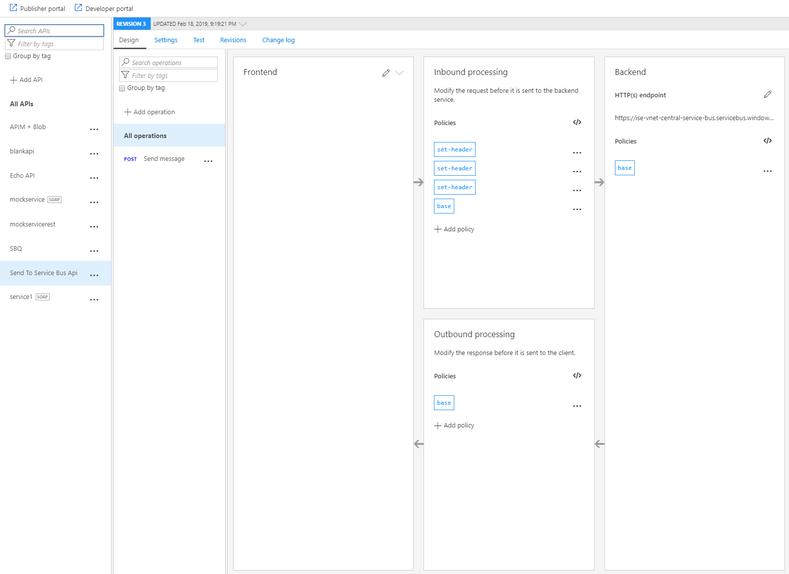

# Setup Service Bus Queue Shared access policy

To create a Service Bus service and its queue, please visit the [Calling Azure Service Bus](README-Call-Service-Bus.md) instructions.

Once a Service Bus service and its queue are created, configure the queue's Shared access policies.

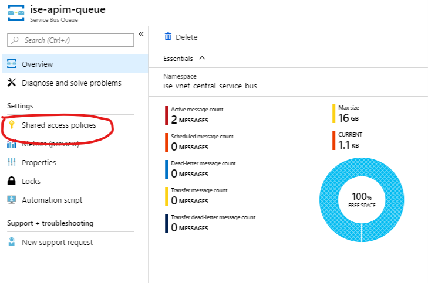

Create a policy for Send, Receive, and Manage.

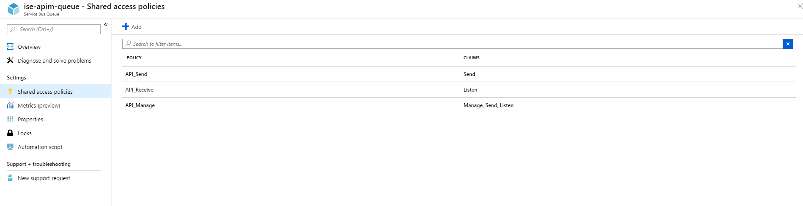

## Obtain Management Credentials

We'll want to get the primary key from the AP_Send SAS policy for further use.

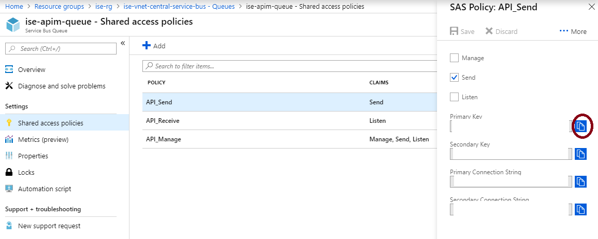

# Setup APIM to Service Bus

To start, we will want a provisionned APIM in your Azure subscription. To provision a new APIM, please follow the instructions in [Create a new Azure API Management service instance](https://docs.microsoft.com/en-us/azure/api-management/get-started-create-service-instance).

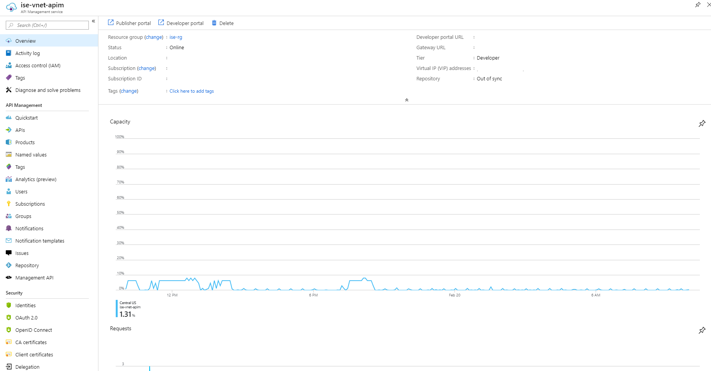

## Add a new Api

We will start with creating a new blank API.

> For the Web serice URL, it should point to your Azure Service Bus Rest Endpoint, where the format would be: http{s}://{serviceNamespace}.servicebus.windows.net/{queue path}

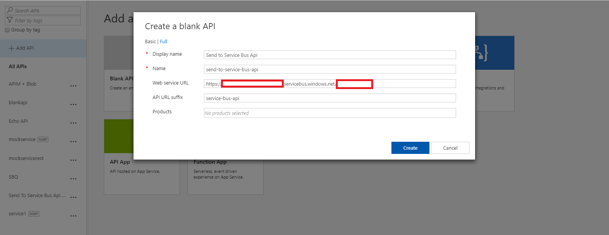

## Add an operation and setup policies

Within the newly created api, add a new operation to send message.

> For URL, in order to create a new message in the Service Bus queue, the action is a POST and the url is /messages

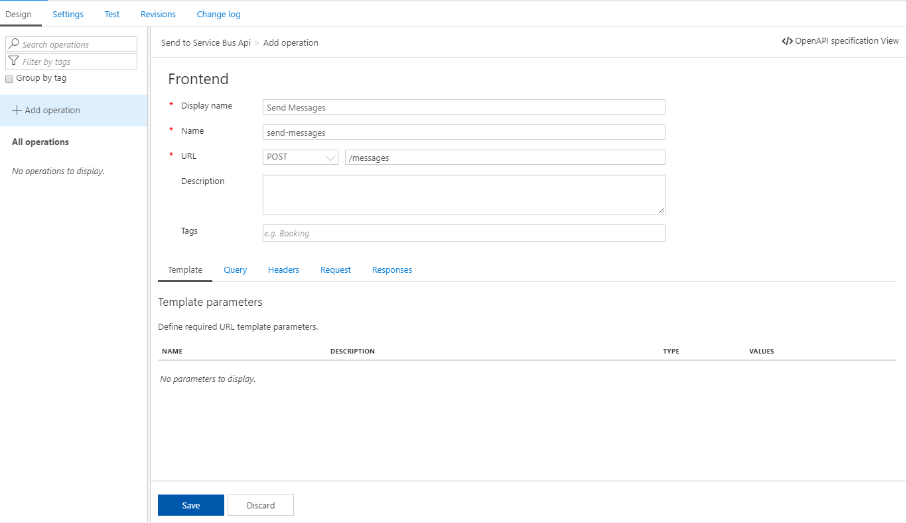

On the same frontend page, click on the Responses tab and add a status code as response to the api request.

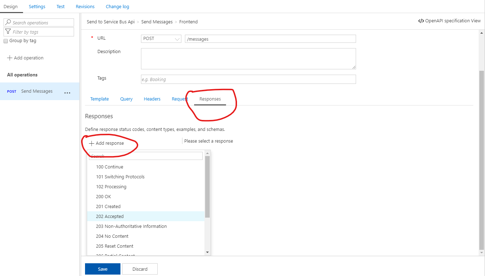

In order to post a message to the service bus, we will need to create proper header within the inbound processing policy. An easy way to add policy is to open the xml code view.

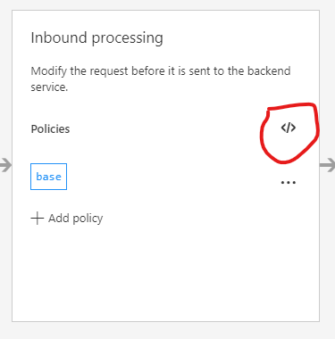

Within the code view, we will then add the following inbound policies.

```xml
<policies>
    <inbound>
        <set-header name="Authorization" exists-action="skip">
            <value><![CDATA[@{
                string resourceUri = "https://{serviceNamespace}.servicebus.windows.net/{queue path}";
                string keyName = "API_Send";
                string key = "{API_Send SAS policy primary key}";

                TimeSpan sinceEpoch = DateTime.UtcNow - new DateTime(1970, 1, 1);
                var expiry = Convert.ToString((int)sinceEpoch.TotalSeconds + 60);
                string stringToSign = System.Uri.EscapeDataString(resourceUri) + "\n" + expiry;
                System.Security.Cryptography.HMACSHA256 hmac = new System.Security.Cryptography.HMACSHA256(System.Text.Encoding.UTF8.GetBytes(key));
                var signature = Convert.ToBase64String(hmac.ComputeHash(System.Text.Encoding.UTF8.GetBytes(stringToSign)));
                var sasToken = String.Format("SharedAccessSignature sr={0}&sig={1}&se={2}&skn={3}", System.Uri.EscapeDataString(resourceUri), System.Uri.EscapeDataString(signature), expiry, keyName);
                return sasToken;
            }]]></value>
        </set-header>
        <set-header name="MessageId" exists-action="skip">
            <value>00000000-0000-0000-0000-000000000000</value>
        </set-header>
        <set-header name="MessageAction" exists-action="skip">
            <value>Undefined</value>
        </set-header>
        <base />
    </inbound>
    <backend>
        <base />
    </backend>
    <outbound>
        <base />
    </outbound>
    <on-error>
        <base />
    </on-error>
</policies>
```

## Add a new product

In Azure API Management, a product contains one or more APIs as well as a usage quota and the terms of use. Once a product is published, developers can subscribe to the product and begin to use the product's APIs.

> After entering the required information, please do not forget to select the recently created api to the product.

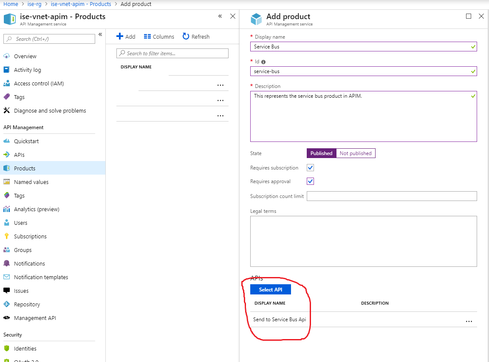

# Validation

To validate that the setup between APIM and Service Bus is done properly, you can open the developer portal, to trigger the api call.

> Make sure that the api call returns a successful response

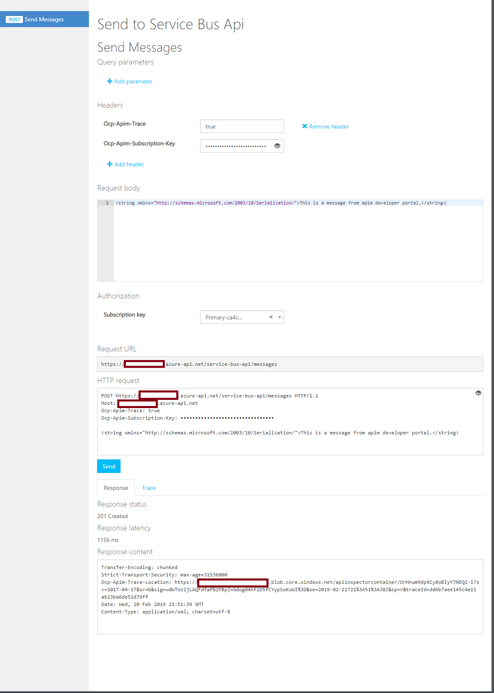

To validate that the message has successfully been created in service bus, tools such as [ServiceBusExplorer](https://github.com/paolosalvatori/ServiceBusExplorer) can help to take a peek at the messages within the queue.

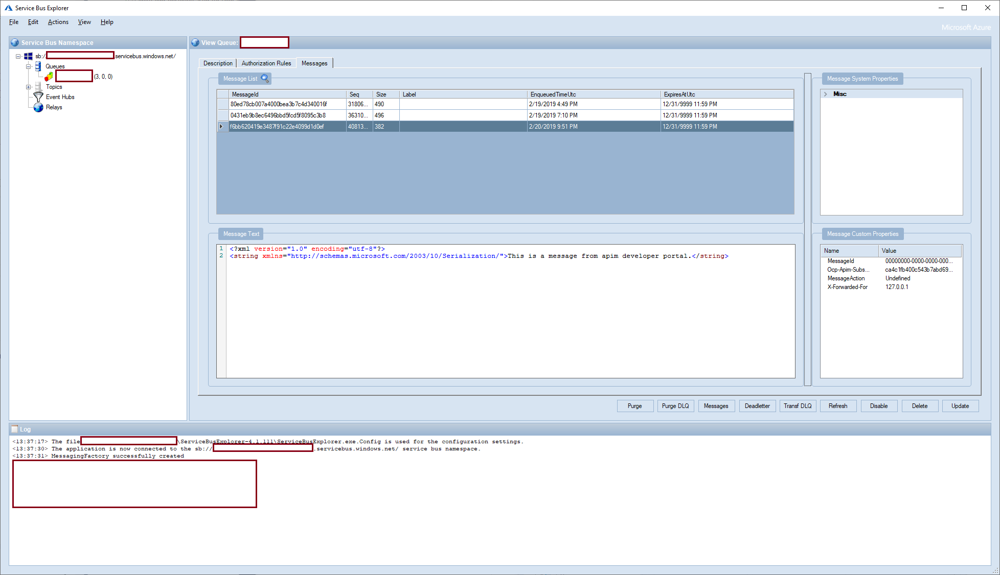

