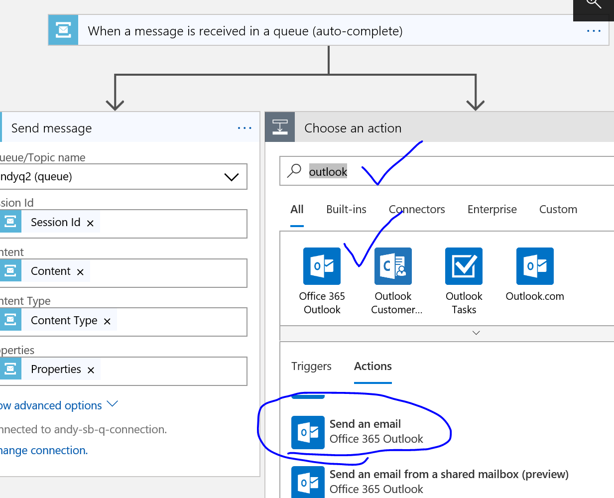
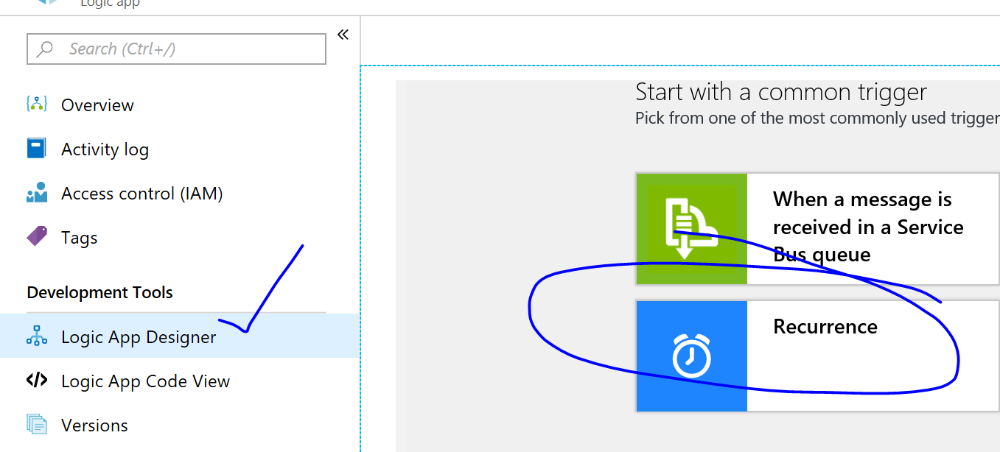
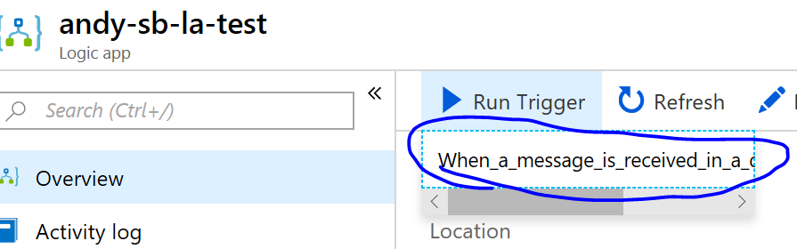

## Calling Azure Service Bus

We can use Logic Apps to call Azure Service Bus.

#### Links

1. [Using Azure Service Bus Logic Apps Connector](https://docs.microsoft.com/en-us/azure/connectors/connectors-create-api-servicebus)
1. [Create Service Bus Namespace](https://docs.microsoft.com/en-us/azure/service-bus-messaging/service-bus-create-namespace-portal)
1. [Service Bus Samples Github](https://github.com/Azure/azure-service-bus/tree/master/samples)
1. [What's Service Bus?](https://docs.microsoft.com/en-us/azure/service-bus-messaging/service-bus-messaging-overview)
1. [What's Azure Logic Apps?](https://docs.microsoft.com/en-us/azure/logic-apps/logic-apps-overview)

# Overview

We'll have 2 logic apps.

One logic app will work with messages from the service bus queue, and send an email notifying that we have received the contents of a message.

A test harness logic app will send messages to the queue that we're actually testing in the service bus queue logic app.

# Create a Service Bus Namespace

We'll use the Azure Portal to create a Service Bus namespace.  This will be a run through of these [Azure Service Bus](https://docs.microsoft.com/en-us/azure/service-bus-messaging/service-bus-create-namespace-portal) instructions.

Configure Service Bus Namespace.

## Obtain Management Credentials

We'll want to get the primary key and the primary connection string for further use.

In the connection string, we'll want to make sure that we're pointing to a service bus.

   > To confirm whether your connection string is associated with 
   > your Service Bus namespace or a messaging entity, such as a queue, 
   > search the connection string for the `EntityPath` parameter. 
   > If you find this parameter, the connection string is for a specific entity, 
   > and isn't the correct string to use with your logic app.

## Create a Queue in the service bus namespace

We'll also stand up a placeholder queue in the service bus namespace.

We can observe that the Queue is created.

# Create a Logic App

The logic app where you want to use Service Bus. Your logic app must exist in the same Azure subscription as your service bus. To start with a Service Bus trigger, [create a blank logic app](https://docs.microsoft.com/en-us/azure/logic-apps/quickstart-create-first-logic-app-workflow).

To use a Service Bus action, start your logic app with another trigger, for example, the Recurrence trigger.

We'll want to provision a logic app.

We'll want to scroll to in the logic app designer to find the blank app template.

We'll configure the trigger to happen when we receive a message in a service bus queue.

We'll set up the connection to the service bus.

We'll want to select the Service Bus Policy.

Select the queue and the we'll want to add another step.

> Some triggers can return one or messages, for example, the trigger, When one or more messages arrive in a queue (auto-complete). When these triggers fire, they return between one and the number of messages specified by the trigger's Maximum message count property.

> All Service Bus triggers are long-polling triggers, which means when the trigger fires, the trigger processes all the messages and then waits 30 seconds for more messages to appear in the queue or topic subscription. If no messages appear in 30 seconds, the trigger run is skipped. Otherwise, the trigger continues reading messages until the queue or topic subscription is empty. The next trigger poll is based on the recurrence interval specified in the trigger's properties.

## We'll set up a second queue for testing.

In the service bus namespace, we'll create a new queue to hold the messages.

## Back to Configuring the service bus action

We'll want to send a message back to Service Bus.

## Test with Email too

We can also send a test email with the service bus queue message.

Select the send email action.

Configure Sending an email with service bus information.

Save the workflow.

## Testing with another Logic App to trigger this Logic App

We could also try testing with C# / HTTP calls / PowerShell or another client, but we'll use another logic app.

We'll create one more logic app that uses a recurrence timer to add a service bus queue message.

We'll want to configure the logic app deployment.

We'll create a logic app with recurrence trigger.

The default timing is fine.  And we can add a new step.

Let's add another service bus action.  We'll want to send a message.

We can use an expression to add the current datetime to the content of a message.

We can now save and run the workflow.

## Viewing the results

Meanwhile, the workflow should run.

We can also trigger the workflow on service bus manually, but we should also be receiving messages in an email.

We should see an email sent with the message received from the tester app for Service Bus, which will trigger the other logic app.

