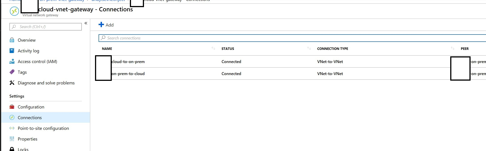
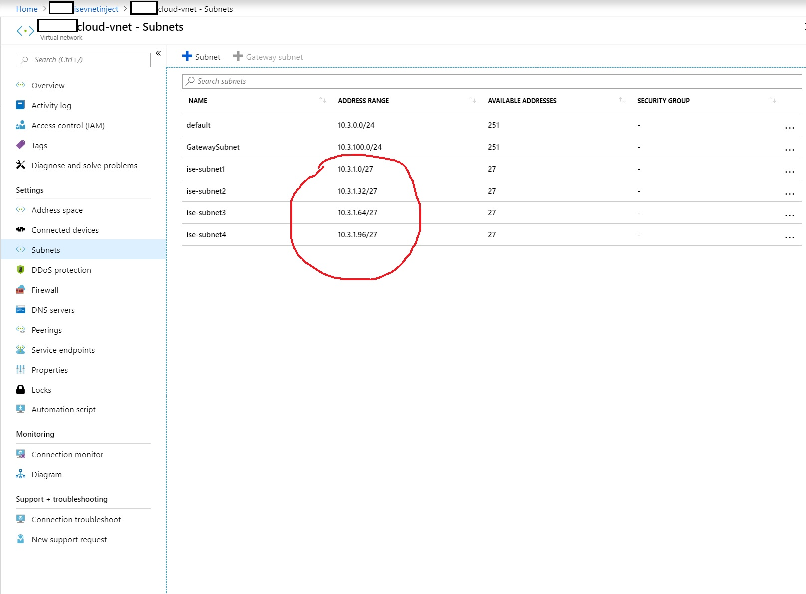
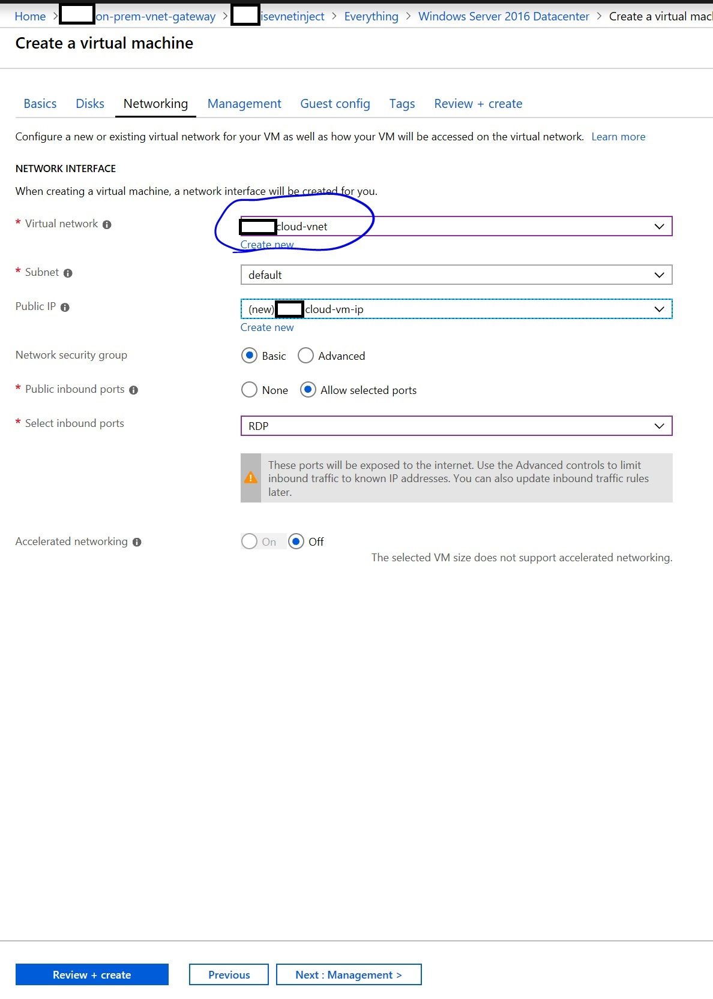
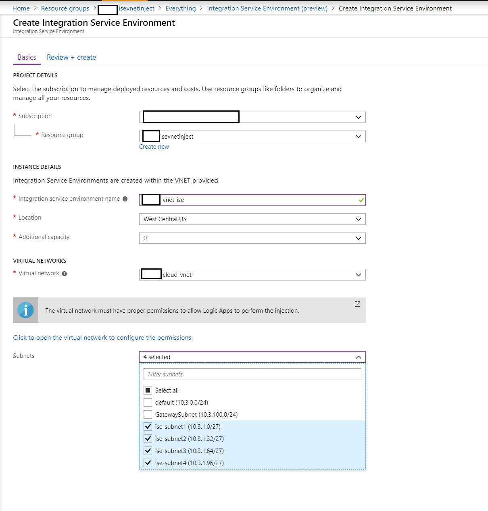
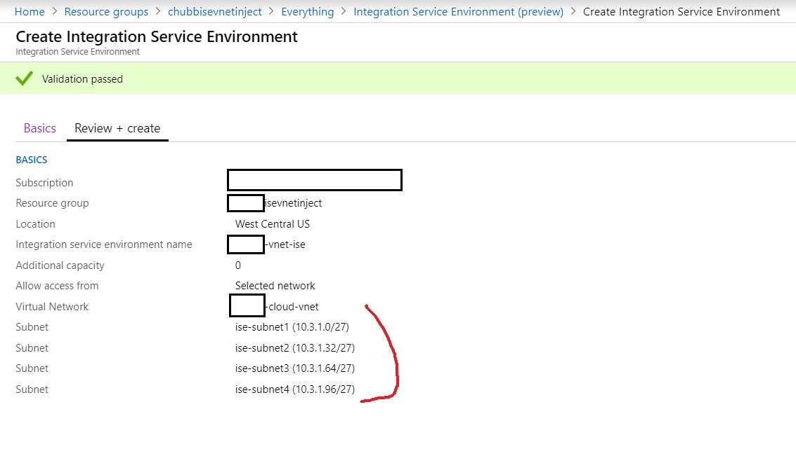
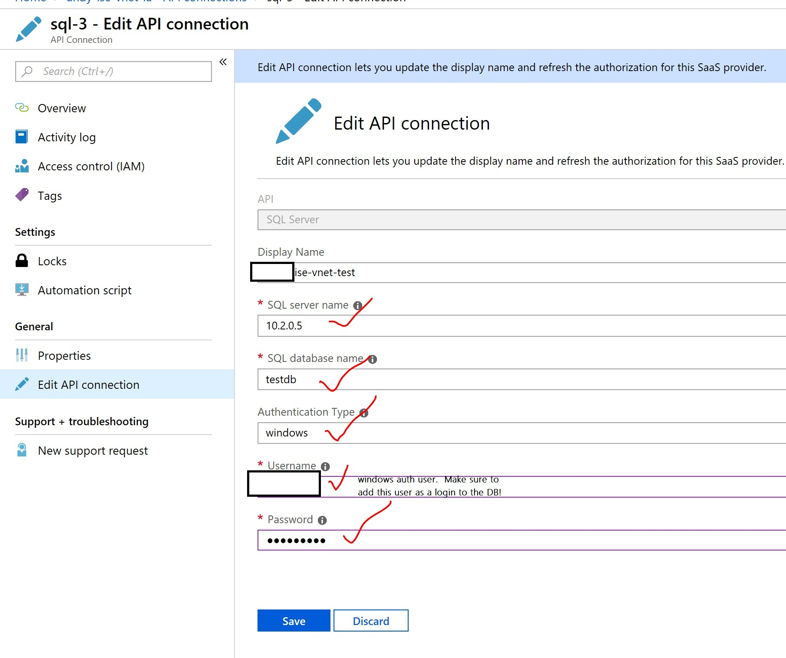

## ISE Logic Apps Overview

Integration Service Environments allow Logic Apps and Integration Accounts to access an Azure Virtual Network.  As of the time of this writing (and per the [documentation](https://docs.microsoft.com/en-us/azure/logic-apps/connect-virtual-network-vnet-isolated-environment)), an ISE is a private and isolated environment.
> An ISE is a private and isolated environment that uses dedicated storage and other resources kept separate from the public or global Logic Apps service. This separation also reduces any impact that other Azure tenants might have on your apps' performance. Your ISE is injected into to your Azure virtual network, which then deploys the Logic Apps service into your virtual network. When you create a logic app or integration account, select this ISE as their location. Your logic app or integration account can then directly access resources, such as virtual machines (VMs), servers, systems, and services, in your virtual network. 

We'll want to use ISE connectors where available if we'd like to connect to on-prem systems, assuming that the ISE is in a VNET that can reach into the on-prem network.  We'll simulate this connectivity with VNET to VNET

#### Links

1. [Connect VNet with ISE and Logic Apps](https://docs.microsoft.com/en-us/azure/logic-apps/connect-virtual-network-vnet-isolated-environment)
1. [Logic Apps Data Gateway Install](https://docs.microsoft.com/en-us/azure/logic-apps/logic-apps-gateway-install)
1. [Connecting to SQL using Powershell SQL CMD](https://virtuallysober.com/2018/05/30/connecting-to-microsoft-sql-databases-using-powershell-invoke-sqlcmd/)
1. [Enable SA on SQL](https://docs.microsoft.com/en-us/sql/database-engine/configure-windows/change-server-authentication-mode?view=sql-server-2017)

# Approach


We're going to use two VNETS to simulate connectivity between the ISE and an on-prem system.  The 'Cloud VNET' will connect to the 'On-Prem Data Center' through VNET to Vnet VPN Gateways.  We'll also want to use an empty Route Table with BGP enabled.

> In other set ups, the 'Cloud VNET' would likely be connected through an Express Route.

The basic test will be attempting to connect to a SQL DB that's in the 'on-prem' VNET through an ISE connector in a Logic App in the ISE.

Our Logic App should resemble something like this:


## Set up the Simulated Network

> For network setup, it would be advisable to check and review these settings with a networking expert with background in Azure Networking in order to adapt to a project's network requirements.  These set of tests are intended to simulate cloud to on-prem connectivity, but a 'real-world' set up will be dependent on the existing network configurations. 

If we don't already have a test resource group in West Central US, let's make one using the Azure CLI.

```azure cli
az group create -l 'west central us' -name 'myvnetinjectrg'
```

### Create the VNETs

Assuming that we've got a resource group created in the **West Central US** location, we can proceed with creating a VNET in the portal.


> Note that the **Cloud VNET** will need to have **4 /27 subnets** available for the ISE to use, and they shouldn't already be assigned to anything else.  **If the ISE creation fails on the first time, we'll want to make sure to clear out the subnets or else create new subnets**.

Similarly, let's create the on-prem VNET in the same resource group, and also in the West Central US location.


### Configure Gateways

We'll want to create the VPN Gateways for the On-Prem VNET and Cloud VNET.  We'll start first with the on-prem VNET VPN Gateway.

We'll want to make sure to use the VPN SKU as well as enable BGP.  Set the gateway subnet address range, and an ASN.  Also, be sure that the location is in **West Central US** and that we're using the existing resource group.


We'll want to have similar settings for the Cloud VNET VPN Gateway.  Of course we'll also use the VPN SKU and enable BGP.  We'll also want a different gateway subnet address range, and a different ASN.  Also, be sure that the location is in **West Central US** and that we're using the existing resource group.


### Add Gateway Connections

We'll want to now connect the gateways that we've set up on the VNETS.

We'll set the connection type to VNET-to-VNET, set the connection first VNET and second VNET, set the Shared Key, and the resource group.

> The Shared Key should be the same between both connections.


This will be largely the same, but we'll switch the first VNET and second VNET.  Otherwise, use the same Shared Key and resource group.


Once these are set, we can verify that the connections exist.



We can also verify that BGP is enabled on the connections.


We can verify with the other connection that it also has BGP enabled.


### Add Route Table

We'll want to set up an empty route table and enable BGP route propagation.


And we'll want to add the gateway subnet to the route table.


### Add Subnets for ISE

We'll want to add the **4 /27 subnets** in the Cloud VNET for the ISE to use.


### Add IAM for Logic Apps in the VNET


Make sure that the VNET has the Azure Logic Apps as a contributor (search IAM with this user 7cd684f4-8a78-49b0-91ec-6a35d38739ba, and this GUID shouldn't change)

Make sure the subnets do not have any delegations set (when using the UI path)

### Testing Network Connectivity

We can attempt a network verification to see if the simulated network will allow endpoints to reach each other through private IPs.


Let's create a VM in the Azure Portal.  When we spin this VM up, we can also set the network to point to the **Cloud VNET**.



Let's create another VM in the Azure Portal.  When we spin this VM up, we can also set the network to point to the **On-Prem VNET**.


Also, while we spinning up VMs, let's also add a SQL VM for testing.  We can search for the SQL Server image in the Azure Marketplace, and point the VNET to the **On-Prem VNET**.


To simplify, we'll use SQL Authentication.  We'll enable this on the SQL VM.


#### SQL Data Setup
We can use the SQL data script in the SQL DB.  Running the script can be handled in multiple ways (Sql Server Management Studio, SQL CMD, etc.)  It may be helpful to try out this [Powershell SQL CMD approach](https://virtuallysober.com/2018/05/30/connecting-to-microsoft-sql-databases-using-powershell-invoke-sqlcmd/) with this [Test SQL Script](../Data/testdb.sql).

#### Enable SA on SQL

We can use an SA account for SQL Authentication.

> For Production, we may want to use an account with more restrictions.

```SQL
ALTER LOGIN sa ENABLE ; GO ALTER LOGIN sa WITH PASSWORD = '<enterStrongPasswordHere>' ; GO 
```

#### TCP Testing with Powershell

We can now verify the network with a handy command from Powershell.  Let's hop onto the **SQL VM** and confirm connectivity to both the **Cloud VM** and **On-Prem VM**.

> Note, we'll want to verify the private ip on each of the VMs.  We can use **ipconfig /all** to pull this up when remoted into the VM.

```powershell
test-netconnection 10.2.0.4 -port 3389
```

```powershell
test-netconnection 10.1.0.4 -port 3389
```


We'll test the On-prem VM Connecivity using the RDP port, and we'll verify with the SQL VM on-prem using the default SQL port.  In this case, we'll test from **Cloud VM**.

```powershell
test-netconnection 10.2.0.5 -port 1433
```

```powershell
test-netconnection 10.2.0.4 -port 3389
```


Similarly, we'll test the Cloud VM Connecivity using the RDP port, and we'll verify with the SQL VM on-prem using the default SQL port.  In this case, we'll test from **On-prem VM**.

```powershell
test-netconnection 10.1.0.4 -port 3389
```

```powershell
test-netconnection 10.2.0.5 -port 1433
```


#### Verify SQL Data using PowerShell

We can also utilize the [verify test script](../Data/verify-test-db.ps1), assuming that we make changes to account for the SQL authentication as well as the endpoints we'd like to test.

We can run that script on the various test VMs to confirm connectivity.

For example, we may end up changing the test query.

```powershell
$TestQuery = "SELECT * FROM [testdb].[dbo].[ContactType]"
```

And we can also set the connection information for a remote SQL instance.

```powershell
$RemoteDefaultSQLInstance  = "10.2.0.5"
$RemoteDefaultSQLInstanceUser = "sa"
$RemoteDefaultSQLInstancePassword = "TheSQLPassword123!"
```

## Set up the ISE

As of current testing, the ISE set up will take **2 hours.**

We'll use the VNET Injection approach for the ISE configuration.

We'll want to search in the Azure Portal for the **Integration Service Environment** to create as a new resource.  

We'll want to make sure to select **4 empty subnets** in the **cloud VNET**.



> This from the [Current Documentation](https://docs.microsoft.com/en-us/azure/logic-apps/connect-virtual-network-vnet-isolated-environment) as of this writing.  Please refer to the existing documentation for the latest and greatest.  It is also helpful to understand ISE configuration considerations, especially with respect to the **VNET** and **Subnets**.

   | Property | Required | Value | Description |
   |----------|----------|-------|-------------|
   | **Subscription** | Yes | <*Azure-subscription-name*> | The Azure subscription to use for your environment | 
   | **Resource group** | Yes | <*Azure-resource-group-name*> | The Azure resource group where you want to create your environment |
   | **Integration Service Environment Name** | Yes | <*environment-name*> | The name to give your environment | 
   | **Location** | Yes | <*Azure-datacenter-region*> | The Azure datacenter region where to deploy your environment | 
   | **Capacity** | Yes | 0, 1, 2, 3 | The number of processing units to use for this ISE resource | 
   | **Virtual network** | Yes | <*Azure-virtual-network-name*> | The Azure virtual network where you want to inject your environment so logic apps in that environment can access your virtual network. If you don't have a network, you can create one here. <p>**Important**: You can *only* perform this injection when you create your ISE. However, before you can create this relationship, make sure you already [set up role-based access control in your virtual network for Azure Logic Apps](https://docs.microsoft.com/en-us/azure/logic-apps/connect-virtual-network-vnet-isolated-environment#vnet-access). | 
   | **Subnets** | Yes | <*IP-address-range*> | An ISE requires four *empty* subnets. These subnets are undelegated to any service and are used for creating resources in your environment. You *can't change* these IP ranges after you create your environment. <p><p>To create each subnet, [follow the steps under this table](https://docs.microsoft.com/en-us/azure/logic-apps/connect-virtual-network-vnet-isolated-environment#create-subnet). Each subnet must meet these criteria: <p>- Must not exist in the same address range for your selected virtual network nor any other private IP addresses where the virtual network is connected. <br>- Uses a name that doesn't start with a number or a hyphen. <br>- Uses the [Classless Inter-Domain Routing (CIDR) format](https://en.wikipedia.org/wiki/Classless_Inter-Domain_Routing). <br>- Requires a Class B address space. <br>- Includes a `/27`. For example, each subnet here specifies a 32-bit address range: `10.0.0.0/27`, `10.0.0.32/27`, `10.0.0.64/27`, and `10.0.0.96/27`. <br>- Must be empty. |
   |||||

We can validate the subnet selection, and the VNET selection.



Assuming that we have network requirements met, as well as permissions for the Logic Apps in Azure AD, and a couple hours:


## Create a Logic App with ISE Connector

We can set up a Logic App, and point to the ISE as the location.


We can use the recurrence template for the Logic App.  In the Logic App designer, we can choose an action.  For this example, we'll want to use the ISE SQL Connector.


We can set the ISE Connection information for SQL.  We can use the domain user name as well with Windows Authentication.  We're also simplifying by using the private IP instead of the FQDN for the SQL VM.



Assuming that we have proper network connectivity from the ISE, we should be able to resolve to SQL and pull rows from a table.


We should be able to run the trigger and see that Get Rows will return results, and a 200 Status code.


## TODOs

### Update subnets for ISE
### ARM deployment

