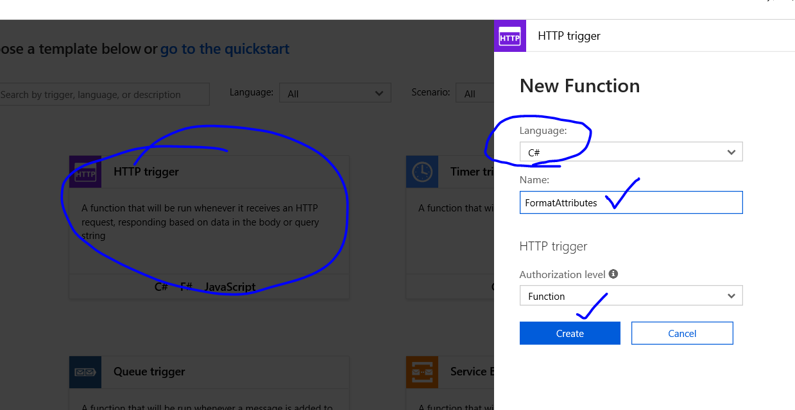
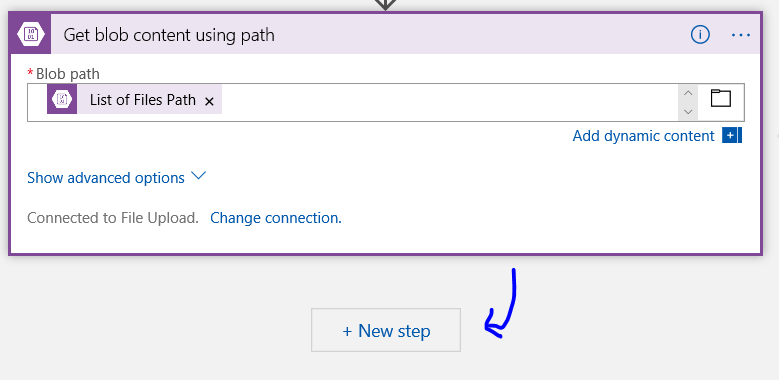
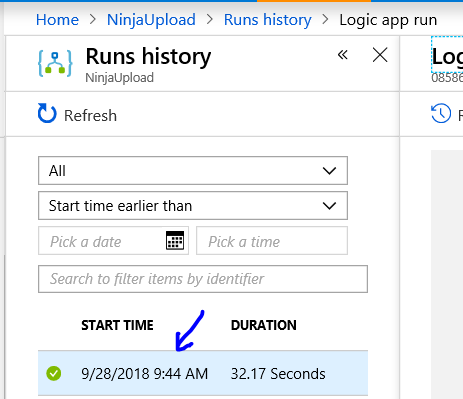

## Using Business Rules Engine
We can add different actions together as part of a logic app.  The conditions are based around results of prior steps.

We're going to 'run through' a lab from a [Logic Apps Repo](https://github.com/codingwithsasquatch/serverless_ninjas_workshop).

#### Links

1. [Logic Apps Repo](https://github.com/codingwithsasquatch/serverless_ninjas_workshop)
1. [Logic App Demo Repo](https://github.com/codingwithsasquatch/serverless_ninjas_workshop/tree/master/5-Logic_App_Overview/Logic_App_Demo)
1. [Set up Environment](https://github.com/codingwithsasquatch/serverless_ninjas_workshop/blob/master/5-Logic_App_Overview/Logic_App_Demo/LogicAppDemoSetup.md)
1. [Clear Data for Cosmos DB](https://github.com/codingwithsasquatch/serverless_ninjas_workshop/blob/master/5-Logic_App_Overview/Logic_App_Demo/ClearData.md)
1. [Storage Explorer](https://azure.microsoft.com/en-us/features/storage-explorer/)

# Serverless Logic App Demo

The Logic App demo is designed to be delivered during the Logic App presenation.  The demo is based off a real-world Logic App implementation, though the data has been changed.

The following Logic App will upload a file that contains a list of characters from Marvel's database.  The list is in a json document, with pipeline delimited text to define the characteristics the charcter.

Once uploaded, each character is then saved as documents in a CosmosDB database, The database can then be used to search for characters that contain the word "Ninja".


> We'll also want to [Set up Environment](https://github.com/codingwithsasquatch/serverless_ninjas_workshop/blob/master/5-Logic_App_Overview/Logic_App_Demo/LogicAppDemoSetup.md) and if we're using Cosmos, we'll want to make sure to  [Clear Data for Cosmos DB](https://github.com/codingwithsasquatch/serverless_ninjas_workshop/blob/master/5-Logic_App_Overview/Logic_App_Demo/ClearData.md).

Our Logic App should resemble something like this:


## Working through the set up

We're going to work through the set up instructions from the repo.
[Set up Environment Instructions.](https://github.com/codingwithsasquatch/serverless_ninjas_workshop/blob/master/5-Logic_App_Overview/Logic_App_Demo/LogicAppDemoSetup.md)

Copy the deployment.json from the repo.  As of this writing, it's located [here](https://github.com/codingwithsasquatch/serverless_ninjas_workshop/blob/master/5-Logic_App_Overview/Logic_App_Demo/deployment.json) but be sure to check the repo as well.

We'll want to follow the rest of the steps to perform a portal deployment in portal.azure.com.  We'll use the template deployment.


We'll use the build your own path.


Load the deployment template.


Click the save button.


Fill in deployment details.  For instance, we'll want the resource group, region, and subscription.


Note that some regions may not support the selected choices in the template.  The region that was successful for this one was **North Central US**.  Also, for simplicity, we created a new resource group to hold these test assets.

Once the deployment succeeds, we'll want to click on it to go to the resource group.


# Creating a Storage Account Container

Inside the new resource group, we'll want to create a storage account blob container.  We'll first enter the storage account.


We'll want to add the blob container to the storage account.  We can give it a name and an access level.


## Storage Explorer

We can also use the storage explorer as tool to access blob storage.

[Storage Explorer](https://azure.microsoft.com/en-us/features/storage-explorer/)

# Create Cosmos DB Collection

We'll want to create a Cosmos DB collection for storing messages from the file.

Back in the storage account, let's look at the Cosmos DB.


Let's add a new collection by clicking on the Add Collection button on the overview.


Add a characters collection.


# Create an Azure Function

In our resource group, let's check on the functions app.  We'll want to add a function to it.


We'll create a new **custom** function on the function app.


We'll create an HTTP Trigger with C#.



Copy the contents of [attributemapfunction.txt](https://github.com/codingwithsasquatch/serverless_ninjas_workshop/blob/master/5-Logic_App_Overview/Logic_App_Demo/setup_data/attributemapfunction.txt) and paste it into the run.csv editor.  Press Save.


For convenience, here's a snapshot of it, but please get the latest from the repo.

```c#

using System.Net;
using System.Text.RegularExpressions;

public static async Task<HttpResponseMessage> Run(HttpRequestMessage req, TraceWriter log)
{
    string jsonContent = await req.Content.ReadAsStringAsync();

            jsonContent = jsonContent.Replace("\\r\\n", "");

            Regex pattern = new Regex("\\|");
            String[] attributes = pattern.Split(jsonContent);


            string output = "\"Attributes\":{";

            foreach (string attribute in attributes)
            {
                if (attribute.Contains("="))
                {
                    Regex patternTitle = new Regex("=");
                    String[] titlevalue = patternTitle.Split(attribute);
                    
                    output = output + "\"" + titlevalue[0].Trim() + "\": \"" + titlevalue[1].Trim() + '"' + ",";
                }
              }

            if (attributes.Last().Contains("Category:"))
            {
                output = output + "\"Category\":[";

                Regex patternCategory = new Regex("Category:");
                String[] category = patternCategory.Split(attributes.Last());

                foreach (string catvalue in category)
                {
                    if (catvalue != category[0])
                        output = output + "\"" + catvalue.Replace("\"}]", "").Trim() + "\",";
                }

                output = output.Remove(output.Length -1) + "]";

            }

            output = output + "}";

            return req.CreateResponse(HttpStatusCode.OK, output);
}
```

# Create an integration account

In portal.azure.com we'll want to create a new integration account.


Configure Integration Account Deployment.  We'll want to make sure to point to the same resource group that we were using in this run.


Navigate to the Integration Account once the deployment succeeds.


Check out the maps tile in the Integration Account.


Make a local copy of [TransformCharacters.liquid](https://github.com/codingwithsasquatch/serverless_ninjas_workshop/blob/master/5-Logic_App_Overview/Logic_App_Demo/setup_data/TransformCharacters.liquid).

We'll use it as part of the mapping configuration.


Once we've finished, we can click Ok to finish mapping.


This will complete the set up portion.

# Storage Explorer and Clean up

We can use the [storage explorer](https://azure.microsoft.com/en-us/features/storage-explorer/) to upload to our blob container.

If we need to clean up between runs please work through these instructions for [Cosmos DB Clean up](https://github.com/codingwithsasquatch/serverless_ninjas_workshop/blob/master/5-Logic_App_Overview/Logic_App_Demo/ClearData.md). 

# Create Logic App

We'll use portal.azure.com and create a new Logic app.


Configure Logic App Deployment.  Be sure to use the same resource group that holds the resources from our setup.  We'll click save when we're ready.


Once the deployment succeeds, let's navigate to the resource.


We'll use the workflow settings to add our provisioned Integration Account.  Click save to finish the association.


We'll want to create a blank Logic app, which is a bit lower than the commoon templates in the Logic App Designer.


We'll want to use a blob storage trigger for the logic app.


Select the trigger.


Configure the Blob Storage Action Connection information.  Then click Create.


Select the blob storage container and leave the frequency at 3 minutes.


## Azure Storage Content

We'll want to add another step now in the workflow.  We'll add a new step for a blob action.


We'll want to get the blob content using path.


We'll use the blob storage path from the prior step.  We can search for path in the dynamic content and add it as the blob path.


## Add a Parse JSON Step

We'll want to add a new step to parse JSON.



Search for Parse JSON, which will show up as a Data operation.


We'll use the dynamic content expression for JSON.


Select the file content next.  Click OK.


Use Sample payload to generate schema.


Copy [sampleschema.json](https://github.com/codingwithsasquatch/serverless_ninjas_workshop/blob/master/5-Logic_App_Overview/Logic_App_Demo/setup_data/sampleschema.json) and paste into editor.  Then press Done.


For convenience, here's a snapshot of the sample json.  Again, fetch the latest from the repo.

```json
{
    "mediawiki": [
      {
        "name": "Emil Blonsky (Earth-616)",
        "ns": "0",
        "id": "1025",
        "sha1": "2k3xr5ig2rkjj7duabfn34ocxp37vn1",
        "revision": {
          "id": "4026809",
          "timestamp": "2017-04-27T00:08:29Z",
          "contributor": {
            "username": "Pythor37",
            "id": "30428606"
          },
          "text": "Marvel Database:Character Template"
        }
      },
      {
        "name": "Absalom (Earth-616)",
        "ns": "0",
        "id": "1026",
        "sha1": "1hhcbop97j5cgpc9egk49rcin3wauwj",
        "revision": {
          "id": "3860877",
          "timestamp": "2017-01-22T21:46:44Z",
          "contributor": {
            "username": "Pythor37",
            "id": "30428606"
          },
          "text": "Marvel Database:Character Template"
        }
      }
    ]
  }
```


## Send Data to Cosmos DB

We'll send characters to the CosmosDB collection.

We'll first want to parse the JSON to split by the pipeline character.  We'll use the attribute function that we created as part of the set up to perform this action.

### Add Azure Function

We'll create a new step for the Azure Function.


Search for Azure Function for an action.


Select the azure function.


Select the pre-created azure function from our setup to Format Attributes.


We'll select text for the dynamic content for the request body.  We'll also receive a For-Each loop to wrap the action.


### Liquid Map

> The text property has now been formatted into a json property.
> We need to use a liquid map to take two json messages and format it into a single message.
> We will need to save the logic app and associate the Integration account.

Add a new action within the For-Each Loop.


We'll want to use the Transform JSON to JSON action.


We'll want to map using the created MapCharacters liquid map.  Next, we'll click on content, and then click on Code View.


Find the content line of the Transform action. Enter the following code:

```json
@addProperty(items('For_each'), 'attributes', body('FormatAttributes'))
```

When finished making the edit to content, we'll want to save and then click on the designer.


### Cosmos DB Connection

We'll add a new step in the for-each loop for Cosmos DB.


We'll want to create or update a document for Cosmos DB.


Enter the Connection Name and select the name of the Cosmos DB. Note that the Connection name is different from the Cosmos DB name and must be entered before the Create button becomes available.


Configure the Create or Update document action.  We'll use the characters db and collection, and our transformed content from the step to transform JSON to JSON.


Save the workflow and close the designer.


# Run the demo

Locate the Blob Storage for Uploading using Storage Explorer.


Copy or upload the [characters.json](https://raw.githubusercontent.com/codingwithsasquatch/serverless_ninjas_workshop/f24af3cad6f2fbf3b193668e6bed1a12b7f8efb6/5-Logic_App_Overview/Logic_App_Demo/demo_data/characters.json) file to the blob storage container.

We can also use powershell to grab a local copy of the file.  Note we're using a specific version of the character.json, which will change soon.

```powershell
start-bitstransfer https://raw.githubusercontent.com/codingwithsasquatch/serverless_ninjas_workshop/f24af3cad6f2fbf3b193668e6bed1a12b7f8efb6/5-Logic_App_Overview/Logic_App_Demo/demo_data/characters.json
```


Back to the logic app, we can run the trigger when a blob is added or modified to avoid waiting for the recurrence.


We can refresh and view the run.  We can review the run results in the run history.



We can review the details of the run.  We'll want to see that each step succeeded.


We can now open Cosmos DB and use the Data Explorer to search for all ninjas in the database. The following SQL Statement will return all results with a category of Ninjas.

```SQL
SELECT * FROM c WHERE ARRAY_CONTAINS(c.Attributes.Category, 'Ninjas')
```

We can also review the contents of the collection using Storage Explorer.

