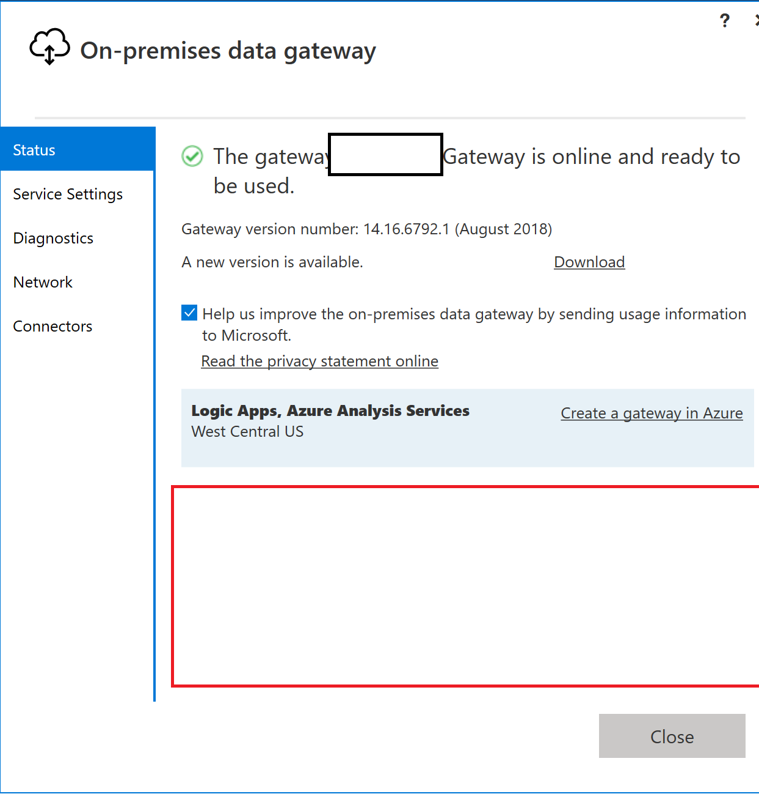
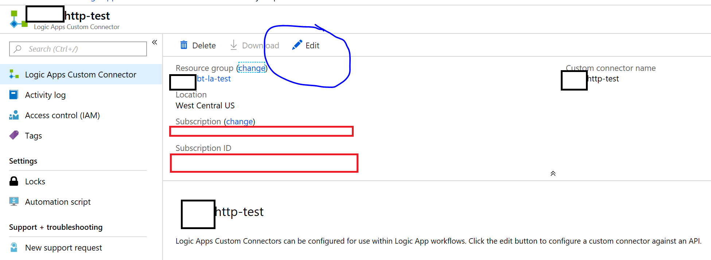
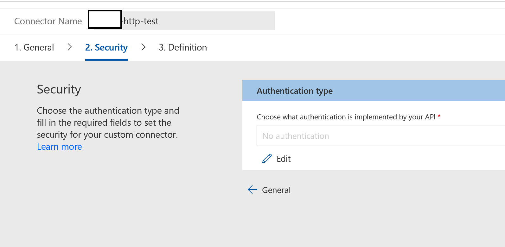
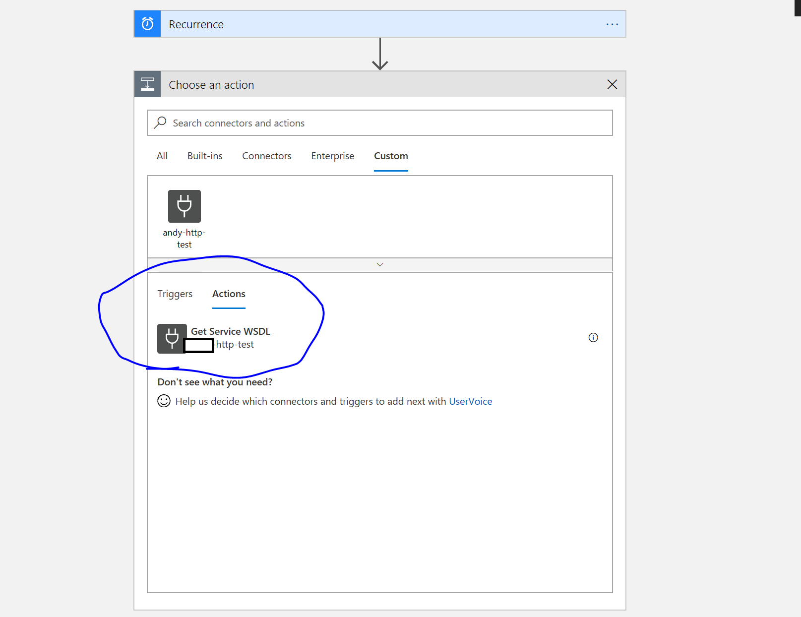

## Custom Connectors in Logic Apps

We'll use a custom connector to call an HTTP endpoint on-prem.

## Links

1. [Custom Connnectors Define Blank](https://docs.microsoft.com/en-us/connectors/custom-connectors/define-blank)
1. [Get Logic App Data Gateway](https://www.microsoft.com/en-us/download/confirmation.aspx?id=53127)
1. [Using Logic Apps Gateway](https://docs.microsoft.com/en-us/azure/logic-apps/logic-apps-gateway-connection)
1. [Install Logic Apps Gateway](https://docs.microsoft.com/en-us/azure/logic-apps/logic-apps-gateway-install)
1. [Blog for Logic Apps and Gateway](https://blogs.biztalk360.com/access-on-premise-sql-server-data-from-azure-logic-apps-via-on-premises-data-gateway/)
1. [Create a Web API and use it with custom connector](https://flow.microsoft.com/en-us/blog/on-premise-apis/)

### Stand up the WCF Service

From code, we can verify that the WCF service will work.  This is the F5 experience with IIS Express.


We'll host the WCF service with a Docker Container.

Build
```
docker build -t wcfservice1:dev -f .\WcfService1\Dockerfile .
```

Dockerfile
```
FROM microsoft/wcf:4.7.1-windowsservercore-1709

EXPOSE 80

WORKDIR /inetpub/wwwroot
COPY WcfService1 .
```

Map port 80 to 80, but otherwise run WCF app
```powershell
docker run -d -p 80:80 wcfservice1:dev
```

In a separate shell, let's verify the IP

```powershell
docker ps # get the running container ID
docker inspect --format="{{range .NetworkSettings.Networks}}{{.IPAddress}} {{end}}" <container id>
```

In the Browser, we should be able to view the .wsdl that associated with the WCF service.  http://<containerip>/Service1.svc?wsdl.

### Use Logic App Data Gateway



Get the computer Name, which we can verify in the app gateway connection.

```powershell
$env:computername
```


We'll also make sure that we expose ports for the WCF app too.  Since we're going to host the WCF app in an IIS container, we'll make sure port 80 is open.

```powershell
netsh advfirewall firewall add rule name = wcfport dir = in protocol = tcp action = allow localport = 80 remoteip = localsubnet

netsh advfirewall firewall add rule name = wcfport_out dir = out protocol = tcp action = allow localport = 80 remoteip = localsubnet
```

### Create Custom Connector

We'll want to create a custom connector to point to the WCF service.


We can also edit the custom connector.




### Configure the Custom Connector (For WCF)

We'll configure the custom connector with the host.  We'll use the container ip, the Logic App Data gateway, and a SOAP passthrough.


We can set up the custom connector security.  In this case we won't use any settings.



We can configure the connector triggers and actions.  In this case we'll want to make sure that we have an action available for the connector.


We can import sample data to make sure that we're picking up the WSDL in the connector.


### Using the connector

Suppose we have a Logic App, and we wanted to use the connector.  Since we have set up the logic app connector action, we can add an action step to a Logic app.



We're going to pass in a value, and this will affect a query string parameter.  Note, we're passing in a value of 1 just to make sure that the connector will use the parameter.


### Testing the Connector

We can run the workflow and check on the result.


Pull in the WSDL locally, which should be similar to to the body that we see in the connector action.  If we were to copy the raw output into an html file, and pop open a browser, it should look like this wsdl.

```
http://containerip/Service1.svc?wsdl
```


