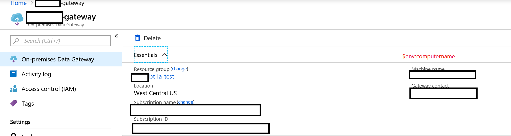
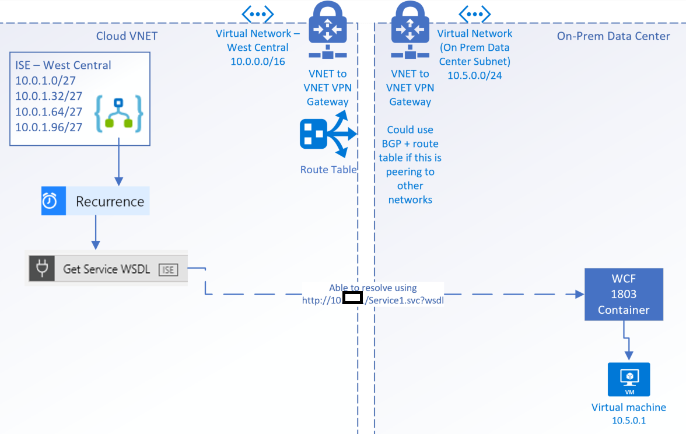
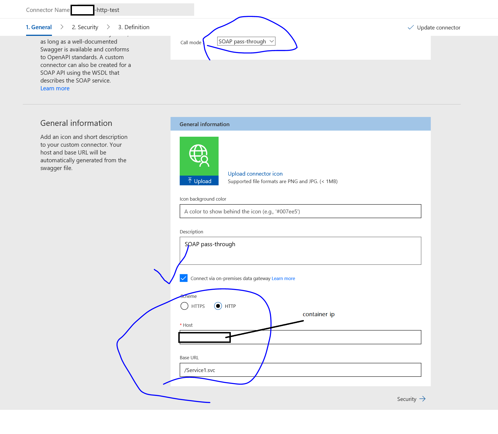
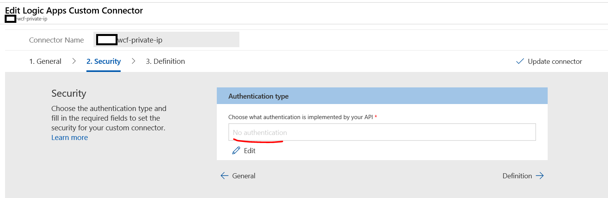

## Custom Connectors in Logic Apps

We'll use a custom connector to call an HTTP endpoint on-prem.

## Links

1. [Custom Connnectors Define Blank](https://docs.microsoft.com/en-us/connectors/custom-connectors/define-blank)
1. [Get Logic App Data Gateway](https://www.microsoft.com/en-us/download/confirmation.aspx?id=53127)
1. [Using Logic Apps Gateway](https://docs.microsoft.com/en-us/azure/logic-apps/logic-apps-gateway-connection)
1. [Install Logic Apps Gateway](https://docs.microsoft.com/en-us/azure/logic-apps/logic-apps-gateway-install)
1. [Blog for Logic Apps and Gateway](https://blogs.biztalk360.com/access-on-premise-sql-server-data-from-azure-logic-apps-via-on-premises-data-gateway/)
1. [Create a Web API and use it with custom connector](https://flow.microsoft.com/en-us/blog/on-premise-apis/)
1. [Connectors For Logic Apps](https://docs.microsoft.com/en-us/azure/connectors/apis-list)

### Stand up the WCF Service

From code, we can verify that the WCF service will work.  This is the F5 experience with IIS Express.


We'll host the WCF service with a Docker Container.

Build
```
docker build -t wcfservice1:dev -f .\WcfService1\Dockerfile .
```

Dockerfile
```
FROM microsoft/wcf:4.7.1-windowsservercore-1709

EXPOSE 80

WORKDIR /inetpub/wwwroot
COPY WcfService1 .
```

Map port 80 to 80, but otherwise run WCF app
```powershell
docker run -d -p 80:80 wcfservice1:dev
```

In a separate shell, let's verify the IP

```powershell
docker ps # get the running container ID
docker inspect --format="{{range .NetworkSettings.Networks}}{{.IPAddress}} {{end}}" <container id>
```

In the Browser, we should be able to view the .wsdl that associated with the WCF service.  http://containerip/Service1.svc?wsdl.

This of course depends on which networks can reach the endpoint.

We could also verify with curl / WGET:

```powershell
curl containerip/Service1.svc?wsdl -useBasicParsing
```

### Use Logic App Data Gateway

> This path will assume that we'd like to run this application gateway on the same host as the WCF service.


Get the computer Name, which we can verify in the app gateway connection.

```powershell
$env:computername
```



We'll also make sure that we expose ports for the WCF app too.  Since we're going to host the WCF app in an IIS container, we'll make sure port 80 is open.

```powershell
netsh advfirewall firewall add rule name = wcfport dir = in protocol = tcp action = allow localport = 80 remoteip = localsubnet

netsh advfirewall firewall add rule name = wcfport_out dir = out protocol = tcp action = allow localport = 80 remoteip = localsubnet
```

### Use an ISE + ISE Custom Connectors

An alternative to using an **on-prem data gateway** is to use an Integration Service Environment.

For ISE Set up, please refer to the companion [Read Me](./README-ISE-Logic-Apps-Overview.md).  It would be advisable to test network connectivity between **on-prem vNET** and **cloud VNETs.**



> If we're using NAT network addressing and hosting the container somewhere else where we do not have the [Logic Apps Gateway](https://docs.microsoft.com/en-us/azure/logic-apps/logic-apps-gateway-install) then we should instead use the container host ip address and a routable port.

We can also verify the **private ip (10.x.x.x)** address using the following in PowerShell:

```powershell
ipconfig /all
```

This private IP will be the one we want to use if we're using an ISE custom connector.

### Create Custom Connector

We'll want to create a custom connector to point to the WCF service.


> If we set the location of the Custom Connector to the ISE that we've created, then we'll have an **ISE Custom Connector** that we can configure.

We can also edit the custom connector.


### Configure the Custom Connector (For WCF) - Logic App Data Gateway

We'll configure the custom connector with the host.  We'll use the container ip, the Logic App Data gateway, and a SOAP passthrough.



We can set up the custom connector security.  In this case we won't use any settings.


We can configure the connector triggers and actions.  In this case we'll want to make sure that we have an action available for the connector.


We can import sample data to make sure that we're picking up the WSDL in the connector.


### Configure the Custom Connector (For WCF) - ISE Connector

If we're using the ISE Connector, the Container IP (unless the container is using Azure CNM) wouldn't be reachable from the ISE Connector.  Instead, we can use the **container host IP** (assuming that we've set up the container with NAT networking port mapping).

Most of the steps should be pretty similar for configuring.

We'll configure the custom connector with the host.  We'll use the **container host private ip** and a SOAP passthrough.


We can set up the custom connector security.  In this case we won't use any settings.



We can configure the connector triggers and actions.  In this case we'll want to make sure that we have an action available for the connector.  We can use the 'import from sample' workflow to add an action.


### Using the connector

Suppose we have a Logic App, and we wanted to use the connector.  Since we have set up the logic app connector action, we can add an action step to a Logic app.


We're going to pass in a value, and this will affect a query string parameter.  Note, we're passing in a value of 1 just to make sure that the connector will use the parameter.


> For ISE Custom Connector, the mechanics are quite similar.  The difference is we'll want to use the 'ISE' tagged custom connector that we've built.

If we've set up our connector, we should be able to place the ISE-based custom connector and point to the action in the Logic App.


### Testing the Connector - Logic App Data Gateway

We can run the workflow and check on the result.


Pull in the WSDL locally, which should be similar to to the body that we see in the connector action.  If we were to copy the raw output into an html file, and pop open a browser, it should look like this wsdl.

```
http://containerip/Service1.svc?wsdl
```


### Testing the Connector - ISE Custom Connector

We can run the workflow and check on the result.


We could also pull in the wsdl and compare from the host itself.


