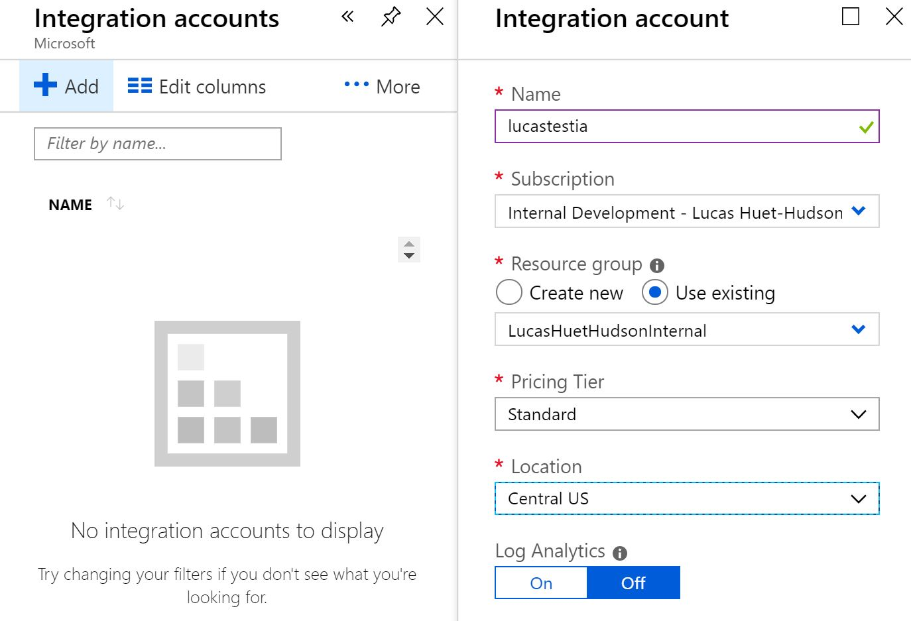
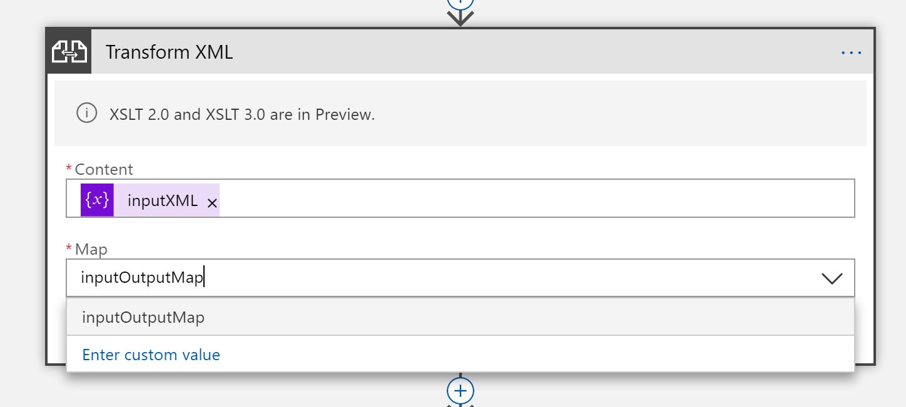

## Using Integration Accounts to Transform XML Within Logic Apps

This document's focus is to describe the process of transforming xml using integration accounts in Azure Logic Apps.

#### Links

1. [What's an Integration Account?](https://azuremarketplace.microsoft.com/en-au/marketplace/apps/Microsoft.IntegrationAccountPackage?tab=Overview)
1. [What's Enterprise Integration Pack?](https://docs.microsoft.com/en-us/azure/logic-apps/logic-apps-enterprise-integration-overview)

# Overview

Azure Integration Account is a service included in the Enterprise Integration Pack and is used for storing schemas, maps, assemblies, etc. When integrated with other Azure services, these files can be acted on to validate and transform schemas. You will take an existing .xslt file and use it within Logic Apps to execute XML transformations. 

# Create an Integration Account

An Integration Account forms the container for the files used in Logic Apps in order to transform, validate, etc. Navigate to the portal and search for 'integration' in the main search bar:

Click 'Add' and fill out the required creation fields. Make sure you create your Integration Account in the same region that the Logic App will be deployed to or it will not be able to connect in future steps:

# Add an .xlst Map to the Integration Account

Once your Integration Acccount has been provisioned, navigate into it and you should be taken to the Integration Account overview. Currently, it will display 0 files stored for each file type:

Click the 'Maps' blade, then 'Add' a new map, and fill out the required fields. You can give your map any name and you must upload a valid .xslt file that will be used later to transform XML:

# Create a Logic App and Connect It to the Integration Account

The Logic App workflow will ultimately connect to the Integration Account in order to execute the transform. Search for 'logic apps' in the main search bar on the portal:

Click 'Add' and fill out the required creation fields. Make sure you create your Logic App in the same region that the Integration Account was deployed into or it will not be able to connect to the account:

Navigate into the newly provisioned Logic App and find the 'Settings' blade

There is a section in the Settings blade titled 'Integration Account'. Select the Integration Account you created earlier:

# Transform XML using the Logic App

The Logic App worflow is currently empty, but the Integration Account has been provisioned and it has been connected successfully. In order to test the .xslt transform, add a simple http trigger and an additional 'Initialize Variable' action, creating an inputXML variable that will be transformed.

Add a new 'Transform XML' action, and select the map created via the Integration Account as well as the variable initialized in the previous step.

Run the workflow to examine the transformed returned XML!